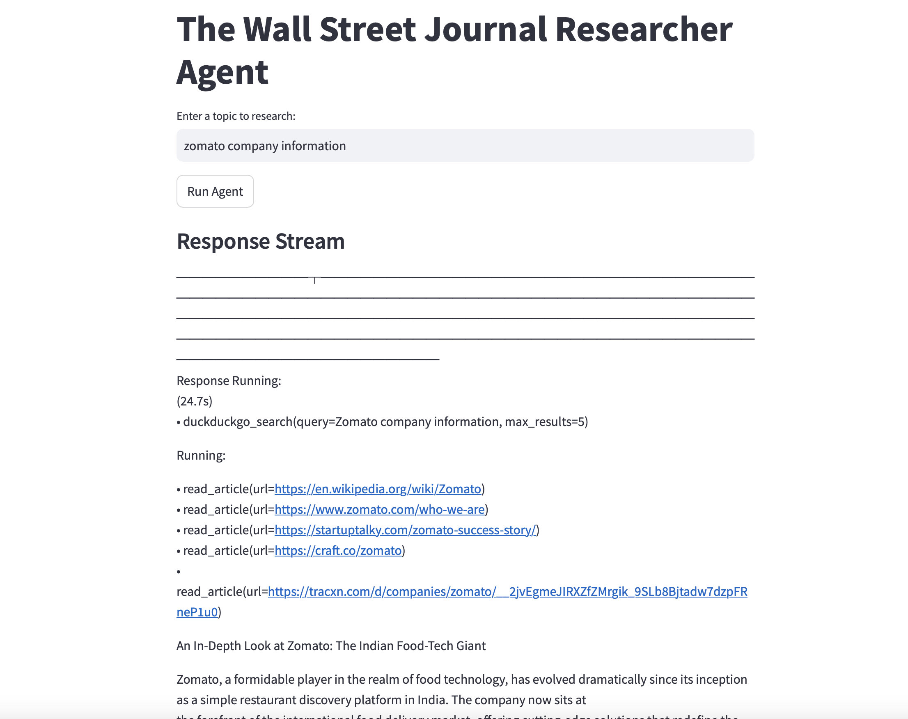

Sure! Here's a README file for the Streamlit app you created:

```markdown
# The Wall Street Journal  Researcher Agent Streamlit App

This Streamlit app uses the `phi` library to create an agent that acts as a senior researcher for The Wall Street Journal. The agent searches for the top links on a given topic, extracts article text, and prepares a comprehensive article based on the information.

## Features

- **Search and Extract**: The agent searches for the top links on a given topic and extracts article text.
- **Analysis and Preparation**: The agent analyzes the extracted information and prepares a detailed article.
- **Streamlit Interface**: A user-friendly interface to input topics and display the generated articles.

## Installation

1. **Clone the Repository**:
   ```bash
   git clone https://github.com/VinitPahwa1985/ResearchAgentAI.git
   cd nyt-researcher-agent
   ```

2. **Install Required Packages**:
   Ensure you have Python installed. Then, install the necessary packages using pip:
   ```bash
   pip install streamlit phi newspaper4k python-dotenv pandas
   ```

3. **Set Up Environment Variables**:
   Create a `.env` file in the same directory as your script and add your OpenAI API key:
   ```plaintext
   OPENAI_API_KEY=your_openai_api_key_here
   ```

## Usage

1. **Run the Streamlit App**:
   Open a terminal or command prompt, navigate to the directory containing `app.py`, and run:
   ```bash
   streamlit run app.py
   ```

2. **Interact with the App**:
   This command will start a local web server and open a new tab in your default web browser. You can then interact with the app by entering a topic and clicking the "Run Agent" button.

## Code Overview

### Main Components

- **Agent Setup**:
  ```python
  agent = Agent(
      model=OpenAIChat(id="gpt-4o"),
      tools=[DuckDuckGo(), Newspaper4k()],
      description="You are a senior The Wall Street Journal researcher writing an article on a topic.",
      instructions=[
          "For a given topic, search for the top 5 links.",
          "Then read each URL and extract the article text, if a URL isn't available, ignore it.",
          "Analyse and prepare an NYT worthy article based on the information.",
      ],
      markdown=True,
      show_tool_calls=True,
      add_datetime_to_instructions=True,
      debug_mode=True,
  )
  ```

- **Function to Capture and Clean Output**:
  ```python
  def capture_pprint_run_response(response_stream: Iterator[RunResponse]) -> str:
      with io.StringIO() as buf, contextlib.redirect_stdout(buf):
          pprint_run_response(response_stream, markdown=True, show_time=True)
          return buf.getvalue()

  def clean_output(output: str) -> str:
      cleaned_output = output.replace('╭', '').replace('╮', '').replace('│', '').replace('╯', '').replace('╰', '')
      cleaned_output = cleaned_output.replace('┏', '').replace('┓', '').replace('┗', '').replace('┛', '')
      cleaned_output = cleaned_output.replace('━', '').replace('┃', '')
      
      lines = cleaned_output.split('\n')
      relevant_lines = []
      for line in lines:
          if 'WARNING' not in line and 'Response Running' not in line:
              relevant_lines.append(line.strip())
      
      unwanted_texts = [
          """As infrastructure advancements like the Namma Metro expansion and improved road networks continue to bolster Bangalore's real estate market, 2024 presents a promising landscape for
      residential investments. The blend of luxurious lifestyle offerings, strategic locations, and a burgeoning IT industry ensures that both end-users and investors find compelling
      opportunities across Bangalore’s thriving residential sector. Whether seeking a vibrant city life or a serene suburban retreat, the city's diverse offerings cater to a wide spectrum
      of preferences and expectations.
      ──────────┴─────────────────────────────────────────────────────────────────────────────────────────────────────────────────────────────────────────────────────────────────────────────────────────"""
      ]
      
      for unwanted_text in unwanted_texts:
          cleaned_output = cleaned_output.replace(unwanted_text, '')
      
      return '\n'.join(relevant_lines).strip()
  ```

- **Function to Run the Agent and Display the Response**:
  ```python
  def run_agent(topic: str):
      try:
          logger.info(f"Running agent for topic: {topic}")
          response_stream: Iterator[RunResponse] = agent.run(topic, stream=True)
          
          response_output = capture_pprint_run_response(response_stream)
          cleaned_output = clean_output(response_output)
          
          st.markdown("### Response Stream")
          st.markdown(cleaned_output.replace('\n', '  \n'))
          
          logger.info("Agent run completed successfully")
      except Exception as e:
          logger.error(f"Error running agent: {e}")
          st.error(f"An error occurred: {e}")
  ```

- **Streamlit App Layout**:
  ```python
  st.title("The Wall Street Journal Researcher Agent")
  topic = st.text_input("Enter a topic to research:", "Google")

  if st.button("Run Agent"):
      run_agent(topic)
  ```

## License

This project is licensed under the MIT License. See the LICENSE file for details.

## Acknowledgements

- Streamlit
- phi
- newspaper4k
- dotenv




## Contributing

Contributions are welcome! Please open an issue or submit a pull request for any improvements or bug fixes.

---

Feel free to customize this README file further based on your specific needs and preferences. Let me know if you need any more help!